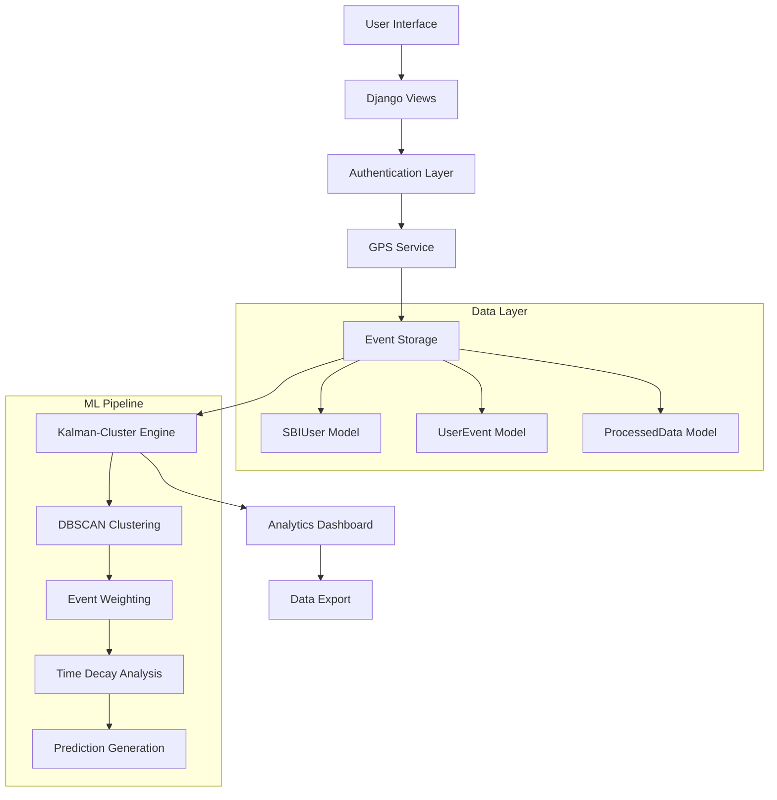

# 🏦 SBI Banking Event Tracking System

<div align="center">


**Advanced Banking Event Tracking System with GPS Location Analytics and Machine Learning**

[🚀 Quick Start](#-quick-start) • [📖 Documentation](#-documentation) • [🔧 API Reference](#-api-reference) • [🛠️ Deployment](#-deployment)

</div>

---

## 📋 Table of Contents

- [🌟 Features](#-features)
- [🏗️ Architecture](#-architecture)
- [🚀 Quick Start](#-quick-start)
- [📖 Documentation](#-documentation)
- [🔧 API Reference](#-api-reference)
- [🛠️ Deployment](#-deployment)
- [🧪 Testing](#-testing)
- [🤝 Contributing](#-contributing)
- [📄 License](#-license)

---

## 🌟 Features

### 👤 **User Portal**

- 🆔 **Aadhaar-based Authentication** - Secure 12-digit Aadhaar number authentication
- 📍 **Real-time GPS Tracking** - Precise location capture with high accuracy requirements
- 🎯 **Multi-Event Support** - Track Login, UPI, and App Open events
- 📊 **Interactive Dashboard** - Real-time event history and location visualization
- 📱 **Mobile-First Design** - Responsive interface optimized for mobile devices

### 🛡️ **Authority Portal**

- 📈 **Advanced Analytics Dashboard** - Comprehensive data visualization and insights
- 📥 **Data Export & Management** - JSON/CSV export capabilities with data filtering
- 🤖 **AI-Powered Processing** - Kalman-Cluster Fusion algorithm for location prediction
- 🔍 **User Search & Tracking** - Individual and bulk user location analysis
- 🗄️ **Admin Panel Integration** - Full Django admin with custom actions

### 🧠 **Kalman-Cluster Fusion Algorithm**

- 🎯 **DBSCAN Clustering** - Geographic clustering with 1.1km radius precision
- ⚖️ **Smart Event Weighting** - UPI (1.0), App Open (0.8), Login (0.6)
- ⏰ **Temporal Analysis** - 72-hour decay with night activity boost (1.2x)
- 🔮 **Predictive Modeling** - Location prediction with confidence scoring
- 📊 **Anomaly Detection** - Identify unusual patterns and behaviors

---

## 🏗️ Architecture



### 🏭 **Technology Stack**

| Layer            | Technology        | Version | Purpose         |
| ---------------- | ----------------- | ------- | --------------- |
| **Backend**      | Django            | 4.2.7   | Web Framework   |
| **Frontend**     | Bootstrap         | 5.3     | UI Framework    |
| **Database**     | SQLite/PostgreSQL | -       | Data Storage    |
| **ML/Analytics** | scikit-learn      | Latest  | Clustering & ML |
| **Location**     | HTML5 Geolocation | -       | GPS Services    |
| **Time Zone**    | pytz              | Latest  | IST Support     |

---

## 🚀 Quick Start

### 📋 **Prerequisites**

```bash
# System Requirements
Python 3.9+
Django 4.2.7+
Modern Web Browser with GPS support
```

### ⚡ **Installation**

1. **Clone the Repository**

   ```bash
   git clone <repository-url>
   cd sbihack
   ```

2. **Set Up Virtual Environment**

   ```bash
   python -m venv venv
   source venv/bin/activate  # On Windows: venv\Scripts\activate
   ```

3. **Install Dependencies**

   ```bash
   pip install -r requirements.txt
   ```

4. **Database Setup**

   ```bash
   python manage.py migrate
   python manage.py collectstatic
   ```

5. **Create Superuser**

   ```bash
   python manage.py createsuperuser
   # Or use existing: admin/admin
   ```

6. **Start Development Server**

   ```bash
   python manage.py runserver
   ```

7. **Access Application**
   - 🌐 **Main App**: http://127.0.0.1:8000/
   - 🛡️ **Authority Portal**: http://127.0.0.1:8000/authority/
   - ⚙️ **Admin Panel**: http://127.0.0.1:8000/admin/

### 🔑 **Default Credentials**

| Role          | Username    | Password       | Access Level        |
| ------------- | ----------- | -------------- | ------------------- |
| **Authority** | `authority` | `authority123` | Authority Dashboard |
| **Admin**     | `admin`     | `admin`        | Full Admin Panel    |

---

## 📖 Documentation

### 🗂️ **Project Structure**

```
sbi_project/
├── 📁 sbi_app/                    # Main application
│   ├── 📄 models.py               # Database models
│   ├── 📄 views.py                # Business logic & APIs
│   ├── 📄 utils.py                # Kalman-Cluster algorithm
│   ├── 📄 forms.py                # User forms
│   ├── 📄 admin.py                # Admin configuration
│   ├── 📄 urls.py                 # URL routing
│   ├── 📁 templates/              # HTML templates
│   ├── 📁 templatetags/           # Custom template filters
│   ├── 📁 management/commands/    # Management commands
│   └── 📁 migrations/             # Database migrations
├── 📁 sbi_project/                # Project configuration
│   ├── 📄 settings.py             # Django settings
│   ├── 📄 urls.py                 # Main URL config
│   └── 📄 wsgi.py                 # WSGI configuration
├── 📁 static/                     # Static files
├── 📄 manage.py                   # Django management
├── 📄 requirements.txt            # Python dependencies
└── 📄 README.md                   # This file
```

### 🗃️ **Database Models**

#### **SBIUser Model**

```python
class SBIUser(AbstractUser):
    aadhaar_number = CharField(max_length=12, unique=True)  # Primary identifier
    phone_number = CharField(max_length=15)
    is_authority = BooleanField(default=False)
    is_defaulter = BooleanField(default=True)
    created_at = DateTimeField(auto_now_add=True)
```

#### **UserEvent Model**

```python
class UserEvent(Model):
    user = ForeignKey(SBIUser, on_delete=CASCADE)
    event_type = CharField(choices=['login', 'upi', 'app_open'])
    latitude = DecimalField(max_digits=10, decimal_places=8)
    longitude = DecimalField(max_digits=11, decimal_places=8)
    location_accuracy = FloatField()
    timestamp = DateTimeField(auto_now_add=True)
    ip_address = GenericIPAddressField(null=True)
    user_agent = TextField(null=True)
```

### 🔗 **URL Patterns**

| URL                     | View                  | Access Level | Description           |
| ----------------------- | --------------------- | ------------ | --------------------- |
| `/`                     | `home`                | Public       | Landing page          |
| `/register/`            | `user_register`       | Public       | User registration     |
| `/login/`               | `user_login`          | Public       | User authentication   |
| `/dashboard/`           | `user_dashboard`      | User         | User portal           |
| `/authority/`           | `authority_dashboard` | Authority    | Authority portal      |
| `/authority/find-user/` | `find_user_location`  | Authority    | Individual tracking   |
| `/authority/find-all/`  | `find_all_locations`  | Authority    | Bulk analysis         |
| `/admin/`               | Django Admin          | Superuser    | System administration |

---

## 🔧 API Reference

### 📍 **Event Recording API**

#### **POST** `/record-event/`

Record a new banking event with GPS coordinates.

**Request Headers:**

```http
Content-Type: application/json
X-CSRFToken: <csrf_token>
```

**Request Body:**

```json
{
  "event_type": "login|upi|app_open",
  "latitude": 26.1234567,
  "longitude": 91.7654321,
  "accuracy": 15.0
}
```

**Response:**

```json
{
  "success": true,
  "message": "Event recorded successfully",
  "event_id": 123,
  "timestamp": "2025-08-02T16:30:45+05:30"
}
```

### 🔍 **User Location Tracking API**

#### **POST** `/authority/find-user/`

Find specific user location using Kalman-Cluster algorithm.

**Request Body:**

```json
{
  "user_identifier": "123456789012" // Aadhaar, username, or email
}
```

**Response:**

```json
{
  "success": true,
  "user_info": {
    "name": "John Doe",
    "aadhaar": "123456789012",
    "is_defaulter": true
  },
  "predicted_location": {
    "latitude": 26.1234567,
    "longitude": 91.7654321,
    "confidence": 0.85,
    "cluster_id": 1,
    "prediction_type": "cluster_based"
  },
  "latest_raw_location": {
    "latitude": 26.123,
    "longitude": 91.765,
    "timestamp": "2025-08-02T16:30:45+05:30",
    "event_type": "upi",
    "accuracy": 10.0
  }
}
```

### 📊 **Data Export API**

#### **GET** `/authority/download/`

Export all user events in JSON format.

**Response:** JSON file download with comprehensive event data.

---

## 🛠️ Deployment

### 🐳 **Docker Deployment**

1. **Create Dockerfile**

   ```dockerfile
   FROM python:3.9-slim

   WORKDIR /app
   COPY requirements.txt .
   RUN pip install -r requirements.txt

   COPY . .

   RUN python manage.py collectstatic --noinput
   RUN python manage.py migrate

   EXPOSE 8000
   CMD ["python", "manage.py", "runserver", "0.0.0.0:8000"]
   ```

2. **Build and Run**
   ```bash
   docker build -t sbi-app .
   docker run -p 8000:8000 sbi-app
   ```

### ☁️ **Cloud Deployment**

#### **Heroku**

```bash
# Install Heroku CLI and login
heroku create sbi-banking-app
heroku config:set DEBUG=False
heroku config:set SECRET_KEY=your-secret-key
git push heroku main
heroku run python manage.py migrate
```

#### **AWS/GCP**

- Use Elastic Beanstalk or App Engine
- Configure PostgreSQL database
- Set up HTTPS for location services
- Configure static file serving

### 🔧 **Production Configuration**

```python
# settings.py - Production overrides
DEBUG = False
ALLOWED_HOSTS = ['your-domain.com', 'www.your-domain.com']

DATABASES = {
    'default': {
        'ENGINE': 'django.db.backends.postgresql',
        'NAME': 'sbi_production',
        'USER': 'sbi_user',
        'PASSWORD': 'secure_password',
        'HOST': 'localhost',
        'PORT': '5432',
    }
}

# Security Settings
SECURE_SSL_REDIRECT = True
SECURE_HSTS_SECONDS = 31536000
SECURE_HSTS_INCLUDE_SUBDOMAINS = True
SECURE_HSTS_PRELOAD = True
```

---

## 🧪 Testing

### 🔬 **Running Tests**

```bash
# Run all tests
python manage.py test

# Run specific app tests
python manage.py test sbi_app

# Run with coverage
pip install coverage
coverage run --source='.' manage.py test
coverage report
coverage html
```

### 📋 **Test Coverage**

- ✅ **User Authentication** - Registration, login, logout
- ✅ **Event Recording** - GPS validation, event types
- ✅ **Location Tracking** - Individual and bulk analysis
- ✅ **Algorithm Testing** - Clustering and prediction accuracy
- ✅ **API Endpoints** - All REST API functionality
- ✅ **Security** - CSRF protection, authentication

### 🎯 **Manual Testing Checklist**

- [ ] User registration with Aadhaar validation
- [ ] GPS permission and location capture
- [ ] Event recording for all types (Login, UPI, App Open)
- [ ] Authority dashboard access and functionality
- [ ] User search and location tracking
- [ ] Data export and algorithm processing
- [ ] Mobile responsiveness and cross-browser compatibility

---

## 🤝 Contributing

### 🛠️ **Development Setup**

1. **Fork the Repository**
2. **Create Feature Branch**
   ```bash
   git checkout -b feature/amazing-feature
   ```
3. **Make Changes**
4. **Run Tests**
   ```bash
   python manage.py test
   ```
5. **Commit Changes**
   ```bash
   git commit -m "Add amazing feature"
   ```
6. **Push to Branch**
   ```bash
   git push origin feature/amazing-feature
   ```
7. **Open Pull Request**

### 📝 **Code Standards**

- Follow PEP 8 for Python code
- Use meaningful variable and function names
- Add docstrings for all functions and classes
- Write tests for new functionality
- Update documentation for API changes

### 🐛 **Bug Reports**

When reporting bugs, please include:

- Python and Django versions
- Browser and version
- Steps to reproduce
- Expected vs actual behavior
- Error messages and logs

---

## 📄 License

This project is licensed under the MIT License - see the [LICENSE](LICENSE) file for details.

---

## 🎯 **Hackathon Highlights**

### ✨ **Why Choose This Project?**

- 🚀 **Production-Ready**: Complete, deployable application
- 🧠 **AI Integration**: Advanced machine learning algorithm
- 📱 **Modern UI/UX**: Professional, responsive design
- 🔒 **Security First**: CSRF protection, secure authentication
- 📊 **Real Analytics**: Meaningful data insights and predictions
- 🌍 **GPS Integration**: Real-world location tracking
- 📖 **Documentation**: Comprehensive setup and API docs

### 🏆 **Demo Flow for Judges**

1. **👥 User Registration** - Show Aadhaar-based signup
2. **📍 GPS Integration** - Demonstrate real-time location capture
3. **🎯 Event Recording** - Record multiple event types
4. **🛡️ Authority Access** - Switch to authority dashboard
5. **🔍 Data Analysis** - Show user tracking and search
6. **🧠 AI Processing** - Run Kalman-Cluster algorithm
7. **📊 Insights** - Display predictions and analytics
8. **📥 Export** - Download comprehensive data reports

### 🎪 **Live Demo Ready**

- ⚡ **Quick Setup**: 5-minute installation
- 🌐 **No External Dependencies**: Works offline
- 📱 **Mobile Friendly**: Test on any device
- 🔄 **Reset Capability**: Clean slate for each demo
- 📋 **Sample Data**: Pre-loaded for immediate demonstration

---

<div align="center">

**Built with ❤️ for SBI Hackathon 2025**

[⬆ Back to Top](#-sbi-banking-event-tracking-system)

</div>

